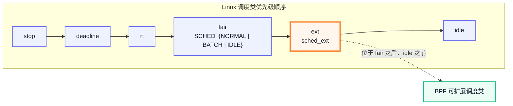
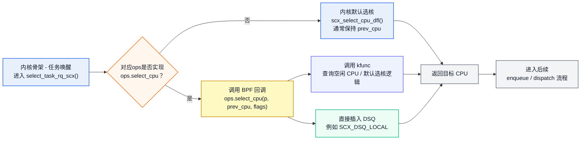
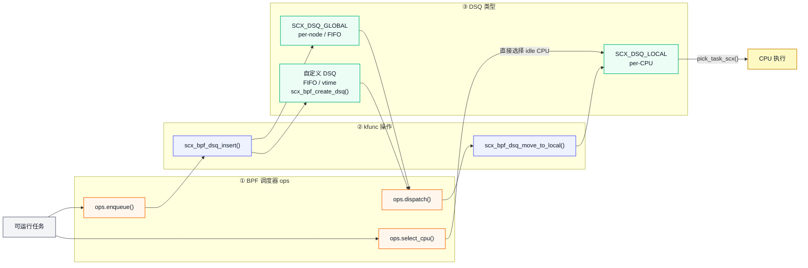
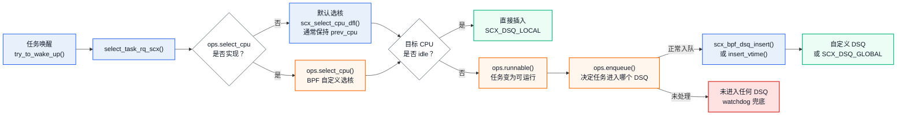
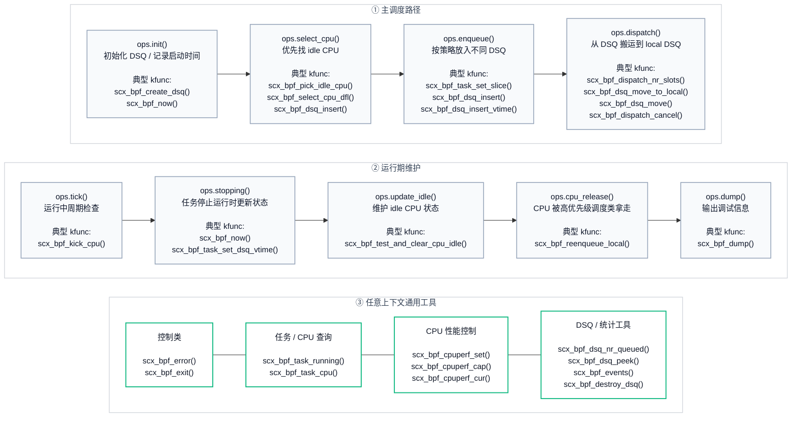
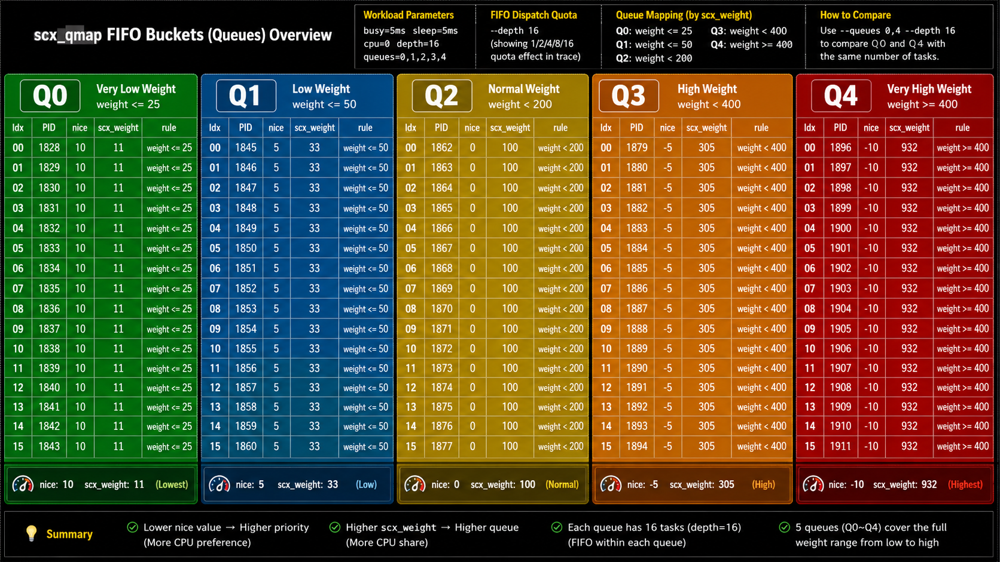
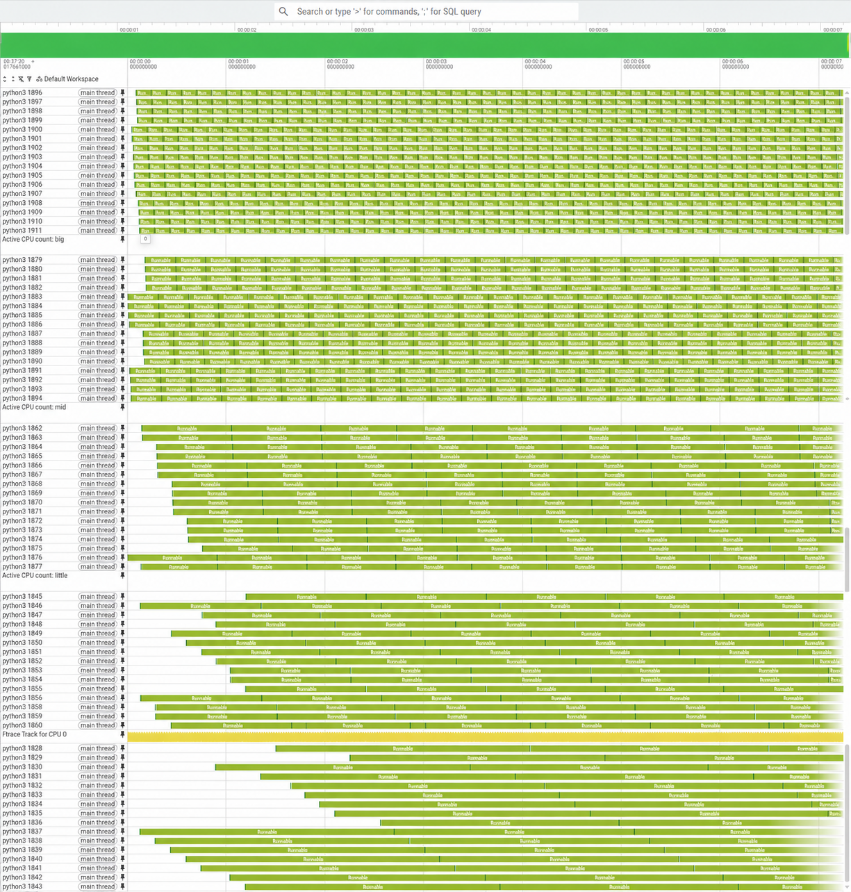

# Linux 内核 sched_ext: BPF 可扩展调度器 — 技术分享

**基于**: Linux 主线源码 (7.1.0-rc4 ~ 7.1.0-rc5) 8bc67e4db64aa72732c474b44ea8622062c903f0

---

# 第一章: sched_ext 是什么

## 1.1 一句话定义

sched_ext 是 Linux 内核的 BPF 可扩展调度器类 (`ext_sched_class`)，允许通过加载 BPF 程序来定义自定义调度策略，无需修改内核源码或重启系统。2024 年合入 Linux 6.12 主线，由 Meta 的 Tejun Heo 和 David Vernet 主导开发。

## 1.2 调度类位置



- ext 位于 fair 之下、idle 之上。链接顺序定义在 `include/asm-generic/vmlinux.lds.h:155-162`。

- 当 BPF 调度器加载且未设 `SCX_OPS_SWITCH_PARTIAL` 时，所有 SCHED_{NORMAL|BATCH|IDLE}、EXT 任务被重定向到 ext 管理 (`kernel/sched/sched.h:2751` 的 `scx_switched_all()`)。

- 当 BPF 调度器加载且设置了 `SCX_OPS_SWITCH_PARTIAL` 时，仅 EXT 任务会被接管。
- SCX_OPS_SWITCH_PARTIAL 的设置方法可参考：tools/sched_ext/scx_qmap.c: skel->struct_ops.qmap_ops->flags |= SCX_OPS_SWITCH_PARTIAL;

## 1.3 三个核心概念

| 概念      | 说明                                 | 数量                   |
| --------- | ------------------------------------ | ---------------------- |
| **ops**   | BPF 程序实现的回调钩子，定义调度行为 | 37 个                  |
| **DSQ**   | 调度队列，任务的容器和排序方式       | 内置 4 种 + 自定义无限 |
| **kfunc** | 内核提供给 BPF 调度器的操作函数      | ~50 个                 |

## 1.4 四者角色与交互

以 `select_cpu`（选核）为例，展示内核骨架、ops、kfunc、DSQ 四者的关系：



---

# 第二章: 核心数据模型

## 2.1 四个核心结构

| 结构               | 定义位置                          | 说明                                                         |
| ------------------ | --------------------------------- | ------------------------------------------------------------ |
| `sched_ext_entity` | `include/linux/sched/ext.h:180`   | 嵌入 task_struct，记录 DSQ 指针、slice 预算、dsq_vtime、weight、runnable_at 等 |
| `scx_dispatch_q`   | `include/linux/sched/ext.h:81`    | DSQ: FIFO 链表 + vtime 红黑树，raw_spinlock 保护             |
| `scx_sched`        | `kernel/sched/ext_internal.h`     | 调度器实例: ops 回调表、DSQ 哈希表、bypass 状态、watchdog 配置 |
| `sched_ext_ops`    | `kernel/sched/ext_internal.h:292` | 37 个 BPF 回调 + 配置字段，通过 `SCX_OPS_DEFINE()` 注册      |

## 2.2 DSQ 模型

| DSQ 类型                 | ID                         | 特点                                                |
| ------------------------ | -------------------------- | --------------------------------------------------- |
| `SCX_DSQ_GLOBAL`         | `0x8000000000000001`       | per-node 拆分，**仅 FIFO**                          |
| `SCX_DSQ_LOCAL`          | `0x8000000000000002`       | per-CPU，调度核心直接消费                           |
| `SCX_DSQ_LOCAL_ON | cpu` | `0xC000000000000000 | cpu` | 指定 CPU 的本地 DSQ                                 |
| `SCX_DSQ_BYPASS`         | `0x8000000000000003`       | bypass 模式专用                                     |
| **自定义**               | 用户指定                   | `scx_bpf_create_dsq()` 创建，**支持 FIFO 和 vtime** |

**备注**: 内置 DSQ 不支持 vtime 排序。

## 2.3 DSQ 数据流



## 2.4 local DSQ 与 cfs_rq 的对比及锁模型

| 维度              | CFS (`cfs_rq`)                                     | sched_ext (`local_dsq`)                                      |
| ----------------- | -------------------------------------------------- | ------------------------------------------------------------ |
| **归属**          | 嵌入 `rq`，root cfs_rq + 多层 group cfs_rq 构成树  | 嵌入 `rq`，每 CPU 仅一个 local_dsq，平坦无层级               |
| **排序**          | 内置红黑树按 vruntime 排序                         | local DSQ 仅 FIFO；vtime 排序仅在自定义 DSQ 中可用           |
| **cgroup**        | 内核内建层级（group se、shares 权重传播）          | 内核不管，由 BPF 用多个自定义 DSQ 自行实现（如 scx_flatcg）  |
| **rq→任务可达性** | `rq → cfs_rq → rbtree → se → task`，指针链完整可达 | local DSQ 可达；自定义 DSQ 中的任务从 rq 不可达，rq 仅维护账本（runnable_list + nr_running） |


### rq 与任务之间的指针可达性

CFS 中，rq 到每个 runnable 任务有完整的指针链：

```
rq → root cfs_rq → rbtree → sched_entity → task
                ↑── group cfs_rq 也有自己的 rbtree
```

sched_ext 中，rq 只持有 local DSQ，自定义 DSQ 存储在全局哈希表 `sch->dsq_hash` 中：

```
rq → rq->scx.local_dsq           ← 仅 local DSQ 在 rq 内部
rq → rq->scx.runnable_list        ← 扁平链表，记录"哪些任务存在"
rq → rq->scx.nr_running           ← 计数器

自定义 DSQ → sch->dsq_hash         ← 全局哈希表，不从 rq 出发可达
task → p->scx.dsq                  ← 任务自己知道属于哪个 DSQ
```

rq 维护的是"账本"（哪些任务 runnable），但在 ext 调度类中不一定掌握任务的排队位置（在哪个 DSQ）。因此需要独立的 `dsq->lock` 保护 DSQ 内部结构。

### 两把锁保护两个维度

| 锁          | 保护对象                                                     |
| ----------- | ------------------------------------------------------------ |
| `rq->lock`  | 任务状态（`on_rq`、`flags`）和属性（`weight`、`slice`）、rq 计数（`nr_running`）、runnable_list |
| `dsq->lock` | DSQ 内部的任务链表/红黑树（排队位置），仅自定义 DSQ 和 global DSQ 需要 |

**local DSQ 嵌入在 `rq->scx` 中，操作时 rq 锁已持有，无需额外的 `dsq->lock`**。

**如果一个任务需要进入自定义 DSQ，自定义 DSQ 与 rq 无直接关联，仍需获取 rq 锁的原因如下**：

- 前置 ttwu 阶段就已获取 rq 锁，与 ext 流程无关。
- 哪怕任务进入自定义 DSQ，与 rq 及 local DSQ 无直接关联，但仍需维护 rq->nr_running 等计数，且需改变该任务的 p->on_rq 等属性信息，都是需要 rq 锁来避免并发竞争的。

### rq 锁的持有时机

rq 锁不是 sched_ext 主动获取的，而是调度框架在入口处就已持有。以任务唤醒为例：

```
try_to_wake_up(p)
  → 持有 p->pi_lock              ← 保护任务自身的调度属性（policy, prio, cpus_ptr 等）
  → ttwu_queue(p, cpu)
    → rq_lock(rq, &rf)           ← 保护 CPU 上的队列和任务运行时状态（on_rq, nr_running 等）
    → ttwu_do_activate(rq, p)
      → activate_task(rq, p)     ← 设置 p->on_rq = QUEUED
        → enqueue_task(rq, p)    ← uclamp、psi 等框架操作
          → enqueue_task_scx()   ← 调度类回调，rq 锁已在手
    → rq_unlock(rq, &rf)
```

---

# 第三章: 调度流程全图

## 图 A: ops 钩子生命周期全图

介绍 sched_ext 的完整生命周期，包含全部 37 个 ops 钩子。

### 阶段 1: 调度器加载

```mermaid
flowchart LR
    A["加载 BPF 程序<br/>libbpf + struct_ops"]
    B["Verifier 检查<br/>kfunc 使用约束"]
    C["scx_enable()"]
    D["进入 Bypass 模式<br/>bypass DSQ + 5ms slice"]
    E["ops.init()<br/>初始化全局状态"]
    F["遍历任务"]
    G["ops.init_task()<br/>初始化任务状态"]
    H["ops.enable()<br/>任务进入 SCX 管理"]
    I["fair → ext"]
    J["退出 Bypass 模式"]
    K["SCX_ENABLED<br/>正式运行"]

    A --> B --> C --> D --> E --> F --> G --> H --> I --> J --> K

    E -. "可调用" .-> E1["scx_bpf_create_dsq()"]
    G -. "可调用" .-> G1["scx_bpf_create_dsq()"]

    I -. "CPU 热插拔通知" .-> H1["ops.cpu_online()<br/>ops.cpu_offline()"]

    classDef normal fill:#f3f4f6,stroke:#9ca3af,stroke-width:1.4px,color:#111827;
    classDef bpf fill:#fff7ed,stroke:#f97316,stroke-width:1.6px,color:#111827;
    classDef state fill:#fef9c3,stroke:#ca8a04,stroke-width:1.6px,color:#111827;
    classDef helper fill:#eef2ff,stroke:#6366f1,stroke-width:1.4px,color:#111827;
    classDef final fill:#ecfdf5,stroke:#10b981,stroke-width:2px,color:#111827;

    class A,B,C,F,I normal;
    class E,G,H bpf;
    class D,J state;
    class E1,G1,H1 helper;
    class K final;
```



### 阶段 2: 任务唤醒与入队路径



### 阶段 3: Dispatch 与任务执行路径

```Mermaid
%%{init: {"themeVariables": {"fontSize": "17px"}, "flowchart": {"curve": "basis", "nodeSpacing": 45, "rankSpacing": 45}}}%%
flowchart LR
    A["CPU 需要选择下一个任务"]
    B{"SCX_DSQ_LOCAL<br/>是否为空？"}

    C["直接从 local DSQ 取任务"]
    D["ops.dispatch(cpu, prev)<br/>local DSQ 为空时调用"]

    E["scx_bpf_dsq_move_to_local()<br/>从其他 DSQ 搬到 local DSQ"]
    F["SCX_DSQ_LOCAL<br/>CPU 最终取任务的位置"]

    G["pick_task_scx()"]
    H["ops.running(p)<br/>任务开始运行"]
    I["任务执行中<br/>消耗 slice"]

    A --> B
    B -- "否" --> C --> F
    B -- "是" --> D --> E --> F

    F --> G --> H --> I

    classDef kernel fill:#e8f1fb,stroke:#2563eb,stroke-width:1.5px,color:#111827;
    classDef ops fill:#fff7ed,stroke:#f97316,stroke-width:1.8px,color:#111827;
    classDef dsq fill:#ecfdf5,stroke:#10b981,stroke-width:1.8px,color:#111827;
    classDef decision fill:#ffffff,stroke:#6b7280,stroke-width:1.5px,color:#111827;

    class A,C,E,G kernel;
    class D,H ops;
    class F dsq;
    class B decision;
```


### 阶段 4：运行后事件与重新调度

```Mermaid
%%{init: {"themeVariables": {"fontSize": "17px"}, "flowchart": {"curve": "basis", "nodeSpacing": 45, "rankSpacing": 45}}}%%
flowchart LR
    A["任务执行中"]
    B["task_tick_scx()"]
    C{"slice<br/>是否耗尽？"}

    D["继续运行"]
    E["ops.tick(p)<br/>可触发 resched"]
    F["ops.stopping(p, runnable)<br/>任务停止运行"]

    G{"是否 yield？"}
    H["ops.yield(from, to)<br/>主动让出 CPU"]
    I["ops.quiescent(p)<br/>任务变为不可运行"]

    J{"后续状态"}
    K["睡眠<br/>等待下次唤醒"]
    L["仍可运行<br/>重新入队"]
    M["ops.dequeue()<br/>离队 / 迁移 / 属性变化"]

    A --> B --> C
    C -- "否" --> D --> A
    C -- "是" --> E --> F

    F --> G
    G -- "是" --> H --> I
    G -- "否" --> I

    I --> J
    J -- "睡眠" --> K
    J -- "被抢占 / 仍可运行" --> L
    I -. "可选事件" .-> M

    classDef kernel fill:#e8f1fb,stroke:#2563eb,stroke-width:1.5px,color:#111827;
    classDef ops fill:#fff7ed,stroke:#f97316,stroke-width:1.8px,color:#111827;
    classDef decision fill:#ffffff,stroke:#6b7280,stroke-width:1.5px,color:#111827;
    classDef state fill:#f3f4f6,stroke:#6b7280,stroke-width:1.4px,color:#111827;

    class B kernel;
    class E,F,H,I,M ops;
    class C,G,J decision;
    class A,D,K,L state;
```

### 阶段 5: 任务退出、调试、安全、调度器退出

```mermaid
flowchart TD
    subgraph "阶段 15: 任务退出"
        TASK_EXIT["任务退出"] --> EXIT_TASK["ops.exit_task(p, args) 🔵<br>清理 per-task 资源"]
        EXIT_TASK --> OPS_DISABLE["ops.disable(p) 🔵<br>任务离开 SCX"]
    end

    subgraph "阶段 16: 调试 (错误退出时触发)"
        DUMP_ALL["scx_dump_state()"] --> OPS_DUMP["ops.dump(ctx) 🔴<br>全局状态 dump<br>使用 scx_bpf_dump() 输出"]
        DUMP_ALL --> OPS_DUMP_CPU["ops.dump_cpu(ctx, cpu, idle) 🔴<br>per-CPU dump"]
        DUMP_ALL --> OPS_DUMP_TASK["ops.dump_task(ctx, p) 🔴<br>per-task dump"]
    end

    subgraph "安全机制 (贯穿运行时)"
        WD["Watchdog 工作队列<br>scx_watchdog_workfn()"] --> CHECK["check_rq_for_timeouts()<br>检查 runnable_at + timeout < now"]
        CHECK -->|"超时"| STALL_EXIT["SCX_EXIT_ERROR_STALL<br>自动退出 → 回退 CFS"]
        CHECK -->|"正常"| WD
        BP["Bypass 模式<br>enable/disable 过渡"] --> BP_DSP["per-CPU bypass DSQ<br>slice=5ms (SCX_SLICE_BYPASS)<br>内置负载均衡"]
        VF["Verifier<br>加载时检查"] --> KF_CTX["scx_kfunc_context_filter()<br>kfunc 按上下文分组验证"]
    end

    subgraph "阶段 17: 调度器退出"
        TRIGGER["触发退出<br>Ctrl+C / scx_bpf_exit() / watchdog / SysRq-S"] --> SCX_DIS["scx_disable()"]
        SCX_DIS --> BYPASS_ON2["进入 Bypass"]
        BYPASS_ON2 --> SWITCH_BACK["所有任务切回 fair"]
        SWITCH_BACK --> OPS_EXIT["ops.exit(info) 🟡<br>info 包含: exit_kind + msg + dump"]
        OPS_EXIT --> CLEANUP["清理所有 SCX 状态"]
        CLEANUP --> DISABLED["SCX_DISABLED"]
    end

    style EXIT_TASK fill:#ADD8E6
    style OPS_DISABLE fill:#ADD8E6
    style OPS_DUMP fill:#D3D3D3
    style OPS_DUMP_CPU fill:#D3D3D3
    style OPS_DUMP_TASK fill:#D3D3D3
    style OPS_EXIT fill:#FFE4B5
    style STALL_EXIT fill:#FFB6C1
```



### 其它 ops

#### CPU 生命周期

```Mermaid
%%{init: {"themeVariables": {"fontSize": "18px"}, "flowchart": {"curve": "linear", "nodeSpacing": 60, "rankSpacing": 40}}}%%
flowchart LR
    IDLE["CPU 进入 / 退出 idle<br/><b>ops.update_idle()</b><br/>自定义 idle CPU 跟踪"]

    RELEASE["CPU 被高优先级调度类拿走<br/><b>ops.cpu_release()</b><br/>释放控制权，可 scx_bpf_reenqueue_local"]

    ACQUIRE["CPU 重新归还 SCX<br/><b>ops.cpu_acquire()</b><br/>重新获得 CPU 控制权"]

    IDLE --- RELEASE --- ACQUIRE

    classDef card fill:#f8fafc,stroke:#64748b,stroke-width:1.8px,color:#0f172a;

    class IDLE,RELEASE,ACQUIRE card;
```

#### 任务属性变化

```Mermaid
%%{init: {"themeVariables": {"fontSize": "18px"}, "flowchart": {"curve": "linear", "nodeSpacing": 60, "rankSpacing": 40}}}%%
flowchart LR
    WEIGHT["nice / 权重变化<br/><b>ops.set_weight()</b><br/>更新任务权重 [1..10000]"]

    MASK["CPU 亲和性变化<br/><b>ops.set_cpumask()</b><br/>更新任务 CPU mask"]

    DEQ["任务离开 BPF custody<br/><b>ops.dequeue()</b><br/>睡眠 / 迁移 / 属性变化"]

    WEIGHT --- MASK --- DEQ

    classDef card fill:#f8fafc,stroke:#64748b,stroke-width:1.8px,color:#0f172a;

    class WEIGHT,MASK,DEQ card;
```

#### Cgroup 与子调度器

```Mermaid
%%{init: {"themeVariables": {"fontSize": "18px"}, "flowchart": {"curve": "linear", "nodeSpacing": 45, "rankSpacing": 45}}}%%
flowchart TB
    subgraph CG["① Cgroup hook"]
        direction TB

        subgraph CG1["生命周期"]
            direction LR
            A["cgroup 创建"] --> B["ops.cgroup_init()<br/>初始化 cgroup<br/>可创建 per-cgroup DSQ"]
            C["cgroup 销毁"] --> D["ops.cgroup_exit()<br/>清理 cgroup 状态"]
        end

        subgraph CG2["任务迁移"]
            direction LR
            E["任务迁移 cgroup"] --> F["ops.cgroup_prep_move()<br/>准备迁移，可阻塞"]
            F --> G{"准备成功？"}
            G -- "是" --> H["ops.cgroup_move()<br/>提交迁移"]
            G -- "否" --> I["ops.cgroup_cancel_move()<br/>取消迁移"]
        end

        subgraph CG3["资源属性变化"]
            direction LR
            J["cgroup 资源属性变化"] --> K["ops.cgroup_set_weight()<br/>ops.cgroup_set_bandwidth()<br/>ops.cgroup_set_idle()"]
        end
    end

    subgraph SUB["② 子调度器 hook"]
        direction LR
        L["子调度器附加到 cgroup"] --> M["ops.sub_attach(args)<br/>父调度器接受或拒绝"]
        N["子调度器分离"] --> O["ops.sub_detach(args)<br/>清理子调度器状态"]
    end

    NOTE["说明：二者都围绕 cgroup 层级工作，但职责不同"] -.-> CG
    NOTE -.-> SUB

    classDef event fill:#f8fafc,stroke:#94a3b8,stroke-width:1.5px,color:#0f172a;
    classDef cghook fill:#f5f3ff,stroke:#8b5cf6,stroke-width:2px,color:#111827;
    classDef subhook fill:#ecfdf5,stroke:#10b981,stroke-width:2px,color:#111827;
    classDef decision fill:#ffffff,stroke:#64748b,stroke-width:1.5px,color:#111827;
    classDef note fill:#fff7ed,stroke:#f59e0b,stroke-width:1.5px,color:#111827;

    class A,C,E,J,L,N event;
    class B,D,F,H,I,K cghook;
    class M,O subhook;
    class G decision;
    class NOTE note;
```

## 图 B: kfunc 示例 — scx_simple_demo

设计一个使用所有主要 kfunc 的调度器，展示每个 kfunc 的角色定位和用法:



### kfunc 上下文约束

Verifier 在加载时检查 kfunc 调用上下文，违规则拒绝加载:

| kfunc Set          | 允许的 ops 上下文             | 包含的 kfunc                                                 |
| ------------------ | ----------------------------- | ------------------------------------------------------------ |
| `enqueue_dispatch` | select_cpu, enqueue, dispatch | `scx_bpf_dsq_insert`, `scx_bpf_dsq_insert_vtime`             |
| `dispatch`         | dispatch                      | `scx_bpf_dsq_move_to_local`, `scx_bpf_dsq_move`, `scx_bpf_dispatch_cancel`, `scx_bpf_dispatch_nr_slots` |
| `select_cpu`       | select_cpu, enqueue           | `scx_bpf_select_cpu_dfl`, `scx_bpf_select_cpu_and`           |
| `unlocked`         | init, init_task               | `scx_bpf_create_dsq`, `scx_bpf_select_cpu_dfl`, `scx_bpf_dsq_move` |
| `cpu_release`      | cpu_release                   | `scx_bpf_reenqueue_local`                                    |
| `idle`             | 任何 (需 idle tracking)       | `scx_bpf_pick_idle_cpu`, `scx_bpf_test_and_clear_cpu_idle`, idle mask 系列 |
| `any`              | 任何                          | `scx_bpf_kick_cpu`, `scx_bpf_error`, `scx_bpf_task_set_slice` 等 |

---

# 第四章: scx_simple 开启与停止调用栈

本章以 `tools/sched_ext/scx_simple.c` 和 `tools/sched_ext/scx_simple.bpf.c` 为例，按真实调用关系梳理一个存量任务在开启、停止 `scx_simple` 时的内核路径。调用栈中同级顺序步骤保持同级，只有真实函数调用关系才向内缩进。

## 4.1 开启 scx_simple: 用户态 attach 到内核启用

```text
tools/sched_ext/scx_simple.c:main:75  # 打开 BPF skeleton，准备 simple_ops
tools/sched_ext/scx_simple.c:main:91  # 加载 BPF 程序和 struct_ops
tools/sched_ext/scx_simple.c:main:92  # attach simple_ops，创建 bpf_link，触发内核 struct_ops 注册
    kernel/sched/ext.c:bpf_scx_reg:7651  # BPF struct_ops .reg 回调
        kernel/sched/ext.c:scx_enable:7445  # 启用 sched_ext 调度器实例
            kernel/sched/ext.c:scx_enable:7476  # 初始化 root enable work
            kernel/sched/ext.c:scx_enable:7479  # 投递到 scx_enable_helper
                kernel/sched/ext.c:scx_root_enable_workfn:6821  # root sched_ext 启用主流程
```

用户态 `SCX_OPS_ATTACH()` 不直接在当前进程里遍历任务，而是通过 struct_ops 注册进入内核，再由 `scx_enable_helper` 这个 RT kthread 执行启用流程。这样可以避免启用过程中当前任务被切到 ext 后，在 fair 饱和场景下被饿死。

## 4.2 开启 scx_simple: 创建调度器实例

```text
kernel/sched/ext.c:scx_root_enable_workfn:6831  # 获取 scx_enable_mutex
kernel/sched/ext.c:scx_root_enable_workfn:6858  # scx_alloc_and_add_sched()，创建 struct scx_sched
kernel/sched/ext.c:scx_root_enable_workfn:6868  # enable_state: DISABLED -> ENABLING
kernel/sched/ext.c:scx_root_enable_workfn:6890  # 发布 scx_root = sch
kernel/sched/ext.c:scx_root_enable_workfn:6901  # 如果 BPF 实现 ops.init，则调用
    tools/sched_ext/scx_simple.bpf.c:SCX_OPS_DEFINE:159  # simple_ops .init = simple_init
```

这个阶段主要是创建 `struct scx_sched` 实例、发布 root 调度器、调用 BPF 的全局初始化回调。此时还没有把所有存量任务切到 `ext_sched_class`。

## 4.3 开启 scx_simple: 第一轮遍历存量任务，只初始化 SCX 状态

```text
kernel/sched/ext.c:scx_root_enable_workfn:6947  # 阻止 fork 并发进入
kernel/sched/ext.c:scx_root_enable_workfn:6950  # scx_init_task_enabled = true
kernel/sched/ext.c:scx_root_enable_workfn:6971  # scx_task_iter_start()，遍历所有存量任务
kernel/sched/ext.c:scx_root_enable_workfn:6993  # p 状态置为 SCX_TASK_INIT_BEGIN
kernel/sched/ext.c:scx_root_enable_workfn:6996  # 初始化单个任务
    kernel/sched/ext.c:__scx_init_task:3560  # __scx_init_task(sch, p, false)
    kernel/sched/ext.c:__scx_init_task:3564  # p->scx.disallow = false
    kernel/sched/ext.c:__scx_init_task:3566  # 如果 BPF 实现 init_task，则调用 ops.init_task
        # scx_simple 没有 .init_task，所以这里不会进入 BPF 回调
kernel/sched/ext.c:scx_root_enable_workfn:7019  # __scx_init_task() 返回后，p 状态置为 SCX_TASK_INIT
kernel/sched/ext.c:scx_root_enable_workfn:7020  # scx_set_task_sched(p, sch)，绑定到 simple 调度器实例
kernel/sched/ext.c:scx_root_enable_workfn:7021  # p 状态置为 SCX_TASK_READY
```

这一轮只是给任务建立 sched_ext 生命周期状态，并把任务绑定到当前调度器实例。它还不修改 `p->sched_class`，所以任务此时仍可能在 fair 上运行。

## 4.4 开启 scx_simple: 打开接管开关

```text
kernel/sched/ext.c:scx_root_enable_workfn:7035  # scx_switching_all = !(ops->flags & SCX_OPS_SWITCH_PARTIAL)
kernel/sched/ext.c:scx_root_enable_workfn:7036  # static_branch_enable(&__scx_enabled)
```

`scx_simple` 没有 `SCX_OPS_SWITCH_PARTIAL`，所以 `scx_switching_all = true`。这表示所有普通 fair 类任务都会被接管；如果设置了 partial 模式，则只有 `SCHED_EXT` policy 的任务进入 ext。

## 4.5 开启 scx_simple: 第二轮遍历，决定任务目标 class

```text
kernel/sched/ext.c:scx_root_enable_workfn:7044  # 第二轮遍历所有任务
kernel/sched/ext.c:scx_root_enable_workfn:7047  # old_class = p->sched_class
kernel/sched/ext.c:scx_root_enable_workfn:7048  # new_class = scx_setscheduler_class(p)
    kernel/sched/ext.c:scx_setscheduler_class:340  # sched_ext 选择目标调度类
    kernel/sched/ext.c:scx_setscheduler_class:345  # return __setscheduler_class(p->policy, p->prio)
        kernel/sched/core.c:__setscheduler_class:7529  # generic policy/prio -> sched_class
        kernel/sched/core.c:__setscheduler_class:7531  # DL 优先返回 dl_sched_class
        kernel/sched/core.c:__setscheduler_class:7534  # RT 返回 rt_sched_class
        kernel/sched/core.c:__setscheduler_class:7538  # task_should_scx(policy) 为真则返回 ext_sched_class
            kernel/sched/ext.c:task_should_scx:4960  # 判断是否应进入 sched_ext
            kernel/sched/ext.c:task_should_scx:4967  # scx_switching_all 为 true，普通 fair 任务也进入 ext
```

因此，存量 `SCHED_NORMAL`、`SCHED_BATCH`、`SCHED_IDLE` 任务在 `scx_simple` 全量模式下会得到 `new_class = &ext_sched_class`。RT/DL 任务不会被强行接管，因为 `__setscheduler_class()` 会先判断 DL/RT。

## 4.6 开启 scx_simple: 从 fair 切到 ext

```text
kernel/sched/ext.c:scx_root_enable_workfn:7053  # old_class != new_class 时设置 DEQUEUE_CLASS
kernel/sched/ext.c:scx_root_enable_workfn:7056  # scoped_guard(sched_change, p, queue_flags)
    kernel/sched/core.c:sched_change_begin:11144  # 开始 class/property 修改事务
    kernel/sched/core.c:sched_change_begin:11162  # 如果旧 class 有 switching_from，先调用
    kernel/sched/core.c:sched_change_begin:11165  # 保存旧 class 到 ctx->class
    kernel/sched/core.c:sched_change_begin:11180  # 如果任务 queued，先 dequeue_task()
    kernel/sched/core.c:sched_change_begin:11182  # 如果任务 running，put_prev_task()
    kernel/sched/core.c:sched_change_begin:11185  # 如果 class 切换，调用旧 class switched_from
        kernel/sched/fair.c:switched_from_fair:13835  # 从 fair 离开
            kernel/sched/fair.c:detach_task_cfs_rq:13815  # 从 CFS rq/PELT 层级 detach
                kernel/sched/fair.c:detach_entity_cfs_rq:13784  # detach fair sched_entity
kernel/sched/ext.c:scx_root_enable_workfn:7057  # 设置 p->scx.slice = sch->slice_dfl
kernel/sched/ext.c:scx_root_enable_workfn:7058  # p->sched_class = ext_sched_class
    kernel/sched/core.c:sched_change_end:11191  # scoped_guard 退出时调用，结束事务
    kernel/sched/core.c:sched_change_end:11205  # 如果新 class 有 switching_to，则调用
        kernel/sched/ext.c:switching_to_scx:3920  # 切入 ext
            kernel/sched/ext.c:switching_to_scx:3923  # scx_enable_task(sch, p)
                kernel/sched/ext.c:scx_enable_task:3643  # enable 单个任务
                    kernel/sched/ext.c:__scx_enable_task:3611  # 核心 enable 逻辑
```

`sched_change_begin()` 先把任务从旧调度类的队列和运行状态中摘出来；修改 `p->sched_class` 后，`sched_change_end()` 再按新调度类重新接管。

## 4.7 开启 scx_simple: 权重转换

```text
kernel/sched/ext.c:__scx_enable_task:3629  # 如果是 SCHED_IDLE，weight = WEIGHT_IDLEPRIO
kernel/sched/ext.c:__scx_enable_task:3632  # 否则 weight = sched_prio_to_weight[p->static_prio - MAX_RT_PRIO]
kernel/sched/ext.c:__scx_enable_task:3634  # p->scx.weight = sched_weight_to_cgroup(weight)
    kernel/sched/sched.h:sched_weight_to_cgroup:266  # CFS weight 转为 SCX/cgroup weight，范围 1..10000
kernel/sched/ext.c:__scx_enable_task:3636  # 如果 BPF 有 ops.enable，调用
    tools/sched_ext/scx_simple.bpf.c:simple_enable:129  # simple 的 enable 回调
    tools/sched_ext/scx_simple.bpf.c:simple_enable:131  # p->scx.dsq_vtime = vtime_now
kernel/sched/ext.c:__scx_enable_task:3639  # 如果 BPF 有 ops.set_weight，通知 BPF 当前 p->scx.weight
```

开启时，权重转换链路是:

```text
nice/static_prio
    -> sched_prio_to_weight[]
        -> sched_weight_to_cgroup()
            -> p->scx.weight
```

也就是说，存量任务进入 `scx_simple` 时不是直接复制 `p->se.load.weight`，而是按当前 `p->static_prio` 重新计算出 `p->scx.weight`。

## 4.8 scx_simple 运行中如何使用权重

```text
tools/sched_ext/scx_simple.bpf.c:simple_enqueue:69  # 任务入队
tools/sched_ext/scx_simple.bpf.c:simple_enqueue:76  # 读取 p->scx.dsq_vtime
tools/sched_ext/scx_simple.bpf.c:simple_enqueue:85  # 按 vtime 插入 shared DSQ

tools/sched_ext/scx_simple.bpf.c:simple_stopping:110  # 任务停止运行时更新 vtime
tools/sched_ext/scx_simple.bpf.c:simple_stopping:124  # delta = scale_by_task_weight_inverse(p, consumed_slice)
    tools/sched_ext/include/scx/common.bpf.h:scale_by_task_weight_inverse:867  # 按 p->scx.weight 反比缩放
    tools/sched_ext/include/scx/common.bpf.h:scale_by_task_weight_inverse:869  # return value * 100 / p->scx.weight
tools/sched_ext/scx_simple.bpf.c:simple_stopping:126  # p->scx.dsq_vtime += delta
```

权重大，`delta` 小，`dsq_vtime` 增长慢，下次更容易靠前。这就是 `scx_simple` 的加权 vtime 调度逻辑。

## 4.9 停止 scx_simple: 用户态销毁 link

```text
tools/sched_ext/scx_simple.c:main:103  # bpf_link__destroy(link)
    kernel/sched/ext.c:bpf_scx_unreg:7656  # BPF struct_ops .unreg
    kernel/sched/ext.c:bpf_scx_unreg:7661  # scx_disable(sch, SCX_EXIT_UNREG)
        kernel/sched/ext.c:scx_disable:6120  # 请求禁用调度器
        kernel/sched/ext.c:scx_disable:6123  # scx_claim_exit() 成功则投递 disable work
            kernel/sched/ext.c:scx_claim_exit:6117  # root 调度器进入 scx_root_disable()
                kernel/sched/ext.c:scx_root_disable:5907  # root disable 主流程
    kernel/sched/ext.c:bpf_scx_unreg:7662  # scx_flush_disable_work(sch)，等待 disable 完成
```

停止时，用户态先销毁 link。内核的 unregister 路径会先把任务从 `ext_sched_class` 安全切出去，再清理 struct_ops 和调度器实例。

## 4.10 停止 scx_simple: 进入 DISABLING

```text
kernel/sched/ext.c:scx_root_disable:5915  # scx_bypass(sch, true)，保证 forward progress
kernel/sched/ext.c:scx_root_disable:5918  # enable_state -> SCX_DISABLING
kernel/sched/ext.c:scx_root_disable:5938  # static_branch_disable(&__scx_switched_all)
kernel/sched/ext.c:scx_root_disable:5939  # scx_switching_all = false
kernel/sched/ext.c:scx_root_disable:5953  # percpu_down_write(&scx_fork_rwsem)，阻止 fork 并发
kernel/sched/ext.c:scx_root_disable:5955  # scx_init_task_enabled = false
```

这一步让系统停止继续把普通 fair 任务导向 ext，并阻止新 fork 任务在 disable 中间插入。

## 4.11 停止 scx_simple: 遍历任务，决定回退 class

```text
kernel/sched/ext.c:scx_root_disable:5957  # scx_task_iter_start()
kernel/sched/ext.c:scx_root_disable:5960  # old_class = p->sched_class
kernel/sched/ext.c:scx_root_disable:5961  # new_class = scx_setscheduler_class(p)
    kernel/sched/ext.c:scx_setscheduler_class:340  # 根据当前 policy/prio 重新选择 class
    kernel/sched/ext.c:scx_setscheduler_class:345  # __setscheduler_class(p->policy, p->prio)
        kernel/sched/core.c:__setscheduler_class:7529  # generic class 选择
        kernel/sched/core.c:__setscheduler_class:7538  # task_should_scx(policy)
            kernel/sched/ext.c:task_should_scx:4963  # scx 不再 enabled 时返回 false
            kernel/sched/ext.c:task_should_scx:4983  # SCX_DISABLING 时返回 false
        kernel/sched/core.c:__setscheduler_class:7542  # 普通任务回到 fair_sched_class
```

对于原本被 `scx_simple` 接管的普通任务，disable 时通常得到 `old_class = ext_sched_class`、`new_class = fair_sched_class`。

## 4.12 停止 scx_simple: 从 ext 切回 fair

```text
kernel/sched/ext.c:scx_root_disable:5965  # old_class != new_class 时设置 DEQUEUE_CLASS
kernel/sched/ext.c:scx_root_disable:5968  # scoped_guard(sched_change, p, queue_flags)
    kernel/sched/core.c:sched_change_begin:11144  # 开始 class 切换事务
    kernel/sched/core.c:sched_change_begin:11180  # 如果 queued，先从 ext dequeue
    kernel/sched/core.c:sched_change_begin:11182  # 如果 running，put_prev_task()
    kernel/sched/core.c:sched_change_begin:11185  # 调用 old class switched_from
        kernel/sched/ext.c:switched_from_scx:3933  # 离开 ext
            kernel/sched/ext.c:switched_from_scx:3948  # scx_disable_task(scx_task_sched(p), p)
                kernel/sched/ext.c:scx_disable_task:3650  # disable 单个任务 ext 状态
                kernel/sched/ext.c:scx_disable_task:3658  # 如果 BPF 有 ops.disable，调用
                kernel/sched/ext.c:scx_disable_task:3660  # p 状态置为 SCX_TASK_READY
kernel/sched/ext.c:scx_root_disable:5969  # p->sched_class = fair_sched_class
```

`scx_simple` 没有 `.disable`，所以离开 ext 时主要是清理 ext enabled 状态，并把任务的调度类改回 fair。

## 4.13 停止 scx_simple: 当前补丁中的 fair weight 恢复

```text
kernel/sched/core.c:sched_change_end:11191  # scoped_guard 退出时调用，结束 class 切换事务
kernel/sched/core.c:sched_change_end:11203  # scx_update_fair_weight_on_class_switch(p, old_class, new_class)
    kernel/sched/ext.h:scx_update_fair_weight_on_class_switch:25  # sched_ext 专用 helper
    kernel/sched/ext.h:scx_update_fair_weight_on_class_switch:29  # 只处理 ext_sched_class -> fair_sched_class
    kernel/sched/ext.h:scx_update_fair_weight_on_class_switch:30  # set_load_weight(p, false)
        kernel/sched/core.c:set_load_weight:1505  # 按 p->static_prio 重建 fair load_weight
        kernel/sched/core.c:set_load_weight:1510  # SCHED_IDLE 使用 WEIGHT_IDLEPRIO
        kernel/sched/core.c:set_load_weight:1514  # 普通任务使用 sched_prio_to_weight[static_prio]
        kernel/sched/core.c:set_load_weight:1525  # p->se.load = lw
```

这个补丁点必须在 fair enqueue 之前执行，因为 fair enqueue/attach 后会开始使用 `p->se.load.weight` 参与 CFS/EEVDF 计算。

## 4.14 停止 scx_simple: fair 重新接管运行时状态

```text
kernel/sched/core.c:sched_change_end:11205  # 如果新 class 有 switching_to，则调用
kernel/sched/core.c:sched_change_end:11208  # 如果任务 queued，则 enqueue_task 到 fair
kernel/sched/core.c:sched_change_end:11213  # class change 后调用 switched_to
    kernel/sched/core.c:sched_change_end:11214  # p->sched_class->switched_to(rq, p)
        kernel/sched/fair.c:switched_to_fair:13840  # fair 接管任务
        kernel/sched/fair.c:switched_to_fair:13844  # attach_task_cfs_rq(p)
            kernel/sched/fair.c:attach_task_cfs_rq:13822  # 获取 p->se
                kernel/sched/fair.c:attach_entity_cfs_rq:13804  # 接回 CFS rq/PELT 层级
                kernel/sched/fair.c:attach_entity_cfs_rq:13809  # update_load_avg()
                kernel/sched/fair.c:attach_entity_cfs_rq:13810  # attach_entity_load_avg()
                kernel/sched/fair.c:attach_entity_cfs_rq:13811  # update_tg_load_avg()
        kernel/sched/fair.c:switched_to_fair:13846  # set_task_max_allowed_capacity(p)
```

fair 这里恢复的是 CFS 运行时、PELT 和容量状态。它不会按 nice 重新计算 `p->se.load`，所以 `set_load_weight(p, false)` 需要放在 `sched_change_end()` 里更早的位置。

## 4.15 停止 scx_simple: 退出 sched_ext 生命周期

```text
kernel/sched/ext.c:scx_root_disable:5972  # scx_disable_and_exit_task(scx_task_sched(p), p)
    kernel/sched/ext.c:__scx_disable_and_exit_task:3670  # 退出单个任务的 sched_ext 生命周期
    kernel/sched/ext.c:__scx_disable_and_exit_task:3680  # 根据 SCX_TASK_* 状态分支
    kernel/sched/ext.c:__scx_disable_and_exit_task:3688  # 如果仍是 ENABLED，则 scx_disable_task()
        kernel/sched/ext.c:scx_disable_task:3650  # 清理 ext enabled 状态
    kernel/sched/ext.c:__scx_disable_and_exit_task:3696  # 如果 BPF 有 ops.exit_task，则调用
```

`scx_simple` 没有 `.exit_task`，所以一般不会有每任务 BPF exit_task。它只有整个 scheduler 的 `.exit`:

```text
tools/sched_ext/scx_simple.bpf.c:SCX_OPS_DEFINE:160  # .exit = simple_exit
```

## 4.16 总览

```text
开启 scx_simple:
    用户态 attach simple_ops
        -> 内核创建 struct scx_sched
            -> 调用 BPF ops.init
                -> 第一轮遍历所有存量任务
                    -> 初始化 p->scx 状态
                    -> 绑定 p 到 simple 调度器实例
                    -> 标记任务为 SCX_TASK_READY
                -> 打开 scx_enabled，调度类 next_active_class 遍历时，也会遍历 ext 调度类的任务
                    -> 第二轮遍历所有存量任务
                        -> 根据 policy/prio 选择目标 class
                        -> 普通 fair 任务切到 ext_sched_class
                        -> 根据 static_prio/nice 计算 p->scx.weight
                        -> 调用 simple_enable()
                            -> 初始化 p->scx.dsq_vtime
                        -> 后续 simple_enqueue/simple_stopping 按 p->scx.weight 做 vtime 调度
                -> 打开 scx_switching_all (非 SCX_OPS_SWITCH_PARTIAL 模式下），调度类 next_active_class 遍历时，会跳过 fair 调度类的任务

停止 scx_simple:
    用户态销毁 bpf_link
        -> 内核 unregister simple_ops
            -> scx_disable()
                -> scx_root_disable()
                    -> 进入 SCX_DISABLING
                    -> 关闭 scx_enabled、scx_switching_all
                    -> 阻止 fork 并发进入
                    -> 遍历所有 sched_ext 任务
                        -> 根据当前 policy/prio 重新选择目标 class
                        -> 普通任务从 ext_sched_class 切回 fair_sched_class
                        -> switched_from_scx() 清理 ext enabled 状态
                        -> set_load_weight(p, false) 重建 p->se.load
                        -> fair enqueue / switched_to_fair() 重新接管 CFS 运行时状态
                    -> 调用 sched_ext 退出清理
                        -> 调用 BPF scheduler 级别 exit 回调
```

---

# 第五章: 安全机制

## 5.1 风险-防护对应

| 风险                   | 防护机制                                                     | 结果                                      |
| ---------------------- | ------------------------------------------------------------ | ----------------------------------------- |
| 任务不被调度 (BPF bug) | Watchdog: `check_rq_for_timeouts()` 检测 `runnable_at + timeout < now` | 触发 `SCX_EXIT_ERROR_STALL`，自动回退 CFS |
| 加载/卸载状态不一致    | Bypass 模式: per-CPU bypass DSQ + 5ms slice + 内置负载均衡   | 过渡期间走简单 FIFO，保证前向推进         |
| BPF 程序越权           | Verifier + `scx_kfunc_context_filter()`                      | 加载时拒绝不合规程序                      |
| 系统无响应             | SysRq-S 强制退出                                             | 立即回退 CFS                              |
| 调度器崩溃丢失信息     | 自动 dump (`ops.dump/dump_cpu/dump_task`)                    | 退出时打印诊断信息                        |

## 5.2 核心结论

**内核保证系统不死锁**（watchdog + bypass + 自动回退），**但不保证调度质量**——延迟、公平性、吞吐量完全取决于 BPF 调度器实现。

### Watchdog

- `scx_watchdog_workfn()` 周期检查所有 CPU 的 runnable 任务列表
- 检测到超时 → `SCX_EXIT_ERROR_STALL` → 自动回退 CFS
- `scx_tick()` 还会检查 watchdog 本身是否卡住
- 超时时间通过 `ops.timeout_ms` 配置，默认 30 秒
- **设计原则**: "系统最终会自愈"，而非"永远不会出问题"

### Bypass

- enable/disable 过渡期间激活，`inc_bypass_depth()` / `dec_bypass_depth()` 控制
- 所有任务放入 per-CPU bypass DSQ，slice 缩短为 5ms
- 内置负载均衡 timer 防止某些 CPU 过载
- **核心意义**: 保证即使在状态切换期间，系统仍能正常工作

### Verifier

- kfunc 按上下文分组 (上表)，BPF verifier 在**加载时**验证
- 不是运行时检查，没有性能开销
- 由 `scx_kfunc_context_filter()` (`kernel/sched/ext.c:9825`) 执行

---

# 第六章: 如何写一个调度器

## 6.1 最小骨架 (基于 scx_cpu0)

```c
#include <scx/common.bpf.h>
char _license[] SEC("license") = "GPL";
#define DSQ_CPU0 0

s32 BPF_STRUCT_OPS(cpu0_select_cpu, struct task_struct *p, s32 prev_cpu, u64 wake_flags)
{
    return 0;  // 始终返回 CPU0
}

void BPF_STRUCT_OPS(cpu0_enqueue, struct task_struct *p, u64 enq_flags)
{
    if (scx_bpf_task_cpu(p) != 0)
        scx_bpf_dsq_insert(p, SCX_DSQ_LOCAL, SCX_SLICE_DFL, 0);
    else
        scx_bpf_dsq_insert(p, DSQ_CPU0, SCX_SLICE_DFL, enq_flags);
}

void BPF_STRUCT_OPS(cpu0_dispatch, s32 cpu, struct task_struct *prev)
{
    if (cpu == 0)
        scx_bpf_dsq_move_to_local(DSQ_CPU0, 0);
}

s32 BPF_STRUCT_OPS_SLEEPABLE(cpu0_init)
{
    return scx_bpf_create_dsq(DSQ_CPU0, -1);
}

SCX_OPS_DEFINE(cpu0_ops,
    .select_cpu = (void *)cpu0_select_cpu,
    .enqueue    = (void *)cpu0_enqueue,
    .dispatch   = (void *)cpu0_dispatch,
    .init       = (void *)cpu0_init,
    .name       = "cpu0");
```

这就是一个完整的 sched_ext 调度器，96 行。

## 6.2 kfunc 分类表

| 功能       | kfunc                                                   | 说明                   |
| ---------- | ------------------------------------------------------- | ---------------------- |
| 创建队列   | `scx_bpf_create_dsq(id, node)`                          | 返回 0 成功            |
| FIFO 插入  | `scx_bpf_dsq_insert(p, dsq, slice, flags)`              | 放入 FIFO DSQ          |
| vtime 插入 | `scx_bpf_dsq_insert_vtime(p, dsq, slice, vtime, flags)` | 按 vtime 排序          |
| 消费队列   | `scx_bpf_dsq_move_to_local(dsq, flags)`                 | 头部任务移到 local DSQ |
| 移动任务   | `scx_bpf_dsq_move(iter, p, dsq, flags)`                 | 迭代中移动单个任务     |
| 设时间片   | `scx_bpf_task_set_slice(p, slice)`                      | 设置 ns                |
| 设 vtime   | `scx_bpf_task_set_dsq_vtime(p, vtime)`                  | 设置虚拟时间           |
| 唤醒 CPU   | `scx_bpf_kick_cpu(cpu, flags)`                          | SCX_KICK_PREEMPT/WAIT  |
| 选 CPU     | `scx_bpf_select_cpu_dfl(p, prev, flags, &idle)`         | 默认选择               |
| 查队列     | `scx_bpf_dsq_nr_queued(dsq)`                            | 返回任务数             |
| 看队头     | `scx_bpf_dsq_peek(dsq)`                                 | 不移除                 |
| 报错       | `scx_bpf_error(fmt, ...)`                               | 触发调度器退出         |
| 调频       | `scx_bpf_cpuperf_set(cpu, target)`                      | DVFS                   |

声明在: `tools/sched_ext/include/scx/common.bpf.h`

## 6.3 设计思路: 5 个关键决策

1. **CPU 选择** (select_cpu): 唤醒时选哪个 CPU？→ cache 亲和性 / 负载均衡 / idle
2. **入队策略** (enqueue): 放入哪个 DSQ？→ 全局 vs 分区 vs per-CPU
3. **排序方式**: FIFO 还是 vtime？→ 延迟 vs 公平性
4. **时间片** (slice): 给多少运行时间？→ 吞吐 vs 响应
5. **Dispatch** (dispatch): 从哪个 DSQ 消费？→ 优先级、权重

**演进路径**: `scx_cpu0 → scx_simple → scx_qmap → scx_flatcg → 生产级 (scx_layered 等)`

## 6.4 常见错误

1. **忘记在 dispatch 中消费自定义 DSQ** — 任务永远不会被调度，watchdog 触发 `SCX_EXIT_ERROR_STALL`
2. **对 SCX_DSQ_GLOBAL 使用 vtime** — 内置 DSQ 不支持 vtime，必须创建自定义 DSQ
3. **select_cpu 选了不允许的 CPU** — 内核会 fallback (`SCX_EV_SELECT_CPU_FALLBACK` 计数器)

---

# 第七章: 示例调度器分析

## 对比总表

| 调度器       | 行数 | 核心目的               | 关键 ops                      | 核心能力                               |
| ------------ | ---- | ---------------------- | ----------------------------- | -------------------------------------- |
| scx_cpu0     | 96   | 最小骨架 / bypass 测试 | select_cpu, enqueue, dispatch | 基本队列操作                           |
| scx_simple   | 161  | 加权公平调度 / 入门    | +tick, stopping, running      | vtime 排序                             |
| scx_qmap     | 1033 | 功能全景               | 全部 ops                      | BPF_QUEUE, cpuperf, core_sched, cgroup |
| scx_central  | 380  | 中心化调度 / tickless  | +update_idle                  | LOCAL_ON, SLICE_INF                    |
| scx_flatcg   | 966  | cgroup 扁平化          | +cgroup_*                     | 层级权重, per-cgroup DSQ               |
| scx_pair     | 610  | SMT 配对               | +cpu_acquire/release          | cgroup 绑定, 核心调度                  |
| scx_userland | 344  | 用户态调度             | +update_idle                  | 用户态决策                             |
| scx_sdt      | 717  | Arena 内存             | +init_task, exit_task         | BPF_MAP_TYPE_ARENA                     |

## 7.1 scx_cpu0: 最小骨架

**核心目的**: `scx_cpu0` 是一个用于理解 sched_ext 基础调度路径的极简调度器。它尝试把可运行任务集中到 CPU0 的自定义 DSQ 上，由 CPU0 消费该队列，适合观察任务集中、队列堆积和 bypass 相关行为。

**脚本验证维度** (`observe_scx_cpu0.sh`):

- sched_ext 是否启用，当前 ops 是否为 `cpu0`。
- 测试任务是否进入 sched_ext (`ext.enabled`)。
- `scx_cpu0` 用户态输出中的 `local=` 和 `cpu0=` 计数是否持续变化。
- 启动 `2 * 在线 CPU 数` 个 CPU-bound 任务后，各任务实际运行在哪些 CPU 上。
- 每个 CPU 的采样窗口利用率分布，用于观察负载是否被集中或重新分散。

## 7.2 scx_simple: 全局加权 vtime

**核心目的**: `scx_simple` 是一个简单的全局调度器。默认模式使用加权 vtime 进行排序，`-f` 模式切换为 FIFO，用于对比“按权重计费的公平调度”和“先入先出调度”的行为差异。

**脚本验证维度** (`observe_scx_simple.sh`):

- sched_ext 是否启用，当前 ops 是否为 `simple`。
- 测试任务是否进入 sched_ext (`ext.enabled`)。
- `scx_simple` 用户态输出中的 `local=` 和 `global=` 计数是否持续变化。
- 两组 CPU-bound 任务是否都被绑定到同一个 CPU 上，形成可对比的竞争关系。
- 每组任务数量等于在线 CPU 数，一组使用 `nice -10`，另一组使用 `nice 10`，观察采样窗口内的 CPU 占比是否体现调度模式差异。
- 对比默认 vtime 模式和 `-f` FIFO 模式下，权重影响是否存在以及 CPU 占比是否趋近平均。

## 7.3 scx_qmap: 五级优先队列

**核心目的**: `scx_qmap` 是一个功能全景型 sched_ext 示例。它用 5 个 `BPF_MAP_TYPE_QUEUE` 按任务权重分桶，再按不同 dispatch quota 轮转取任务，同时展示 task storage、shared DSQ、core-sched、cpuperf、stall 测试等能力。本节重点看“五级 FIFO 队列 + 加权轮转 dispatch”。

**重要边界**: `scx_qmap` 的“五级优先队列”不等价于内核 RT 调度类的严格优先级队列。RT 语义通常是“高优先级非空时低优先级不运行”；`scx_qmap` 的语义是加权轮转，Q4 有任务时 Q0..Q3 仍可能运行，只是 Q4 每轮最多 dispatch 的次数更多。

**weight 分桶**:

| qmap 队列 | weight 条件     | 脚本 nice | 脚本 scx_weight | 含义             |
| --------- | --------------- | --------- | --------------- | ---------------- |
| Q0        | `weight <= 25`  | `10`      | `11`            | 最低 qmap 桶     |
| Q1        | `weight <= 50`  | `5`       | `33`            | 较低 qmap 桶     |
| Q2        | `weight < 200`  | `0`       | `100`           | 默认 nice 所在桶 |
| Q3        | `weight < 400`  | `-5`      | `305`           | 较高 qmap 桶     |
| Q4        | `weight >= 400` | `-10`     | `932`           | 最高 qmap 桶     |

**dispatch quota**:

| qmap 队列 | 每轮最多 dispatch 次数 |
| --------- | ---------------------- |
| Q0        | 1                      |
| Q1        | 2                      |
| Q2        | 4                      |
| Q3        | 8                      |
| Q4        | 16                     |

这里的 quota 表示“每轮最多从该 FIFO 取多少个任务”，不是“某个任务连续运行多少次”。如果每个队列只有 1 个任务，Q4 即使 quota=16，也只能取出 1 个任务，剩余 quota 会因为 FIFO 为空而失效，所以 trace 容易看起来像全局 FIFO。要观察 quota 差异，需要让被比较的队列都有足够 backlog，并控制任务数量一致。

**实现逻辑**:

- `weight_to_idx()` 根据 `p->scx.weight` 把任务映射到 Q0..Q4。
- 普通 `enqueue()` 使用 `bpf_map_push_elem()` 把 PID 放入对应 `BPF_MAP_TYPE_QUEUE`。
- `dispatch()` 通过 `dsp_idx` 选择当前 FIFO，通过 `dsp_cnt = 1 << dsp_idx` 形成 1/2/4/8/16 的轮转 quota。
- 从 BPF FIFO pop 出来的任务先被插入 `SHARED_DSQ`，再由内核消费到 local DSQ 运行。
- `SCX_ENQ_REENQ`、direct dispatch、local DSQ fast path 等路径可能绕过 5 个 BPF FIFO；分析 trace 时不能只看 `sched_switch`，还要结合任务是否主动 sleep、是否启用 `-I`、以及 workload 是否形成 FIFO backlog。
- `BPF_MAP_TYPE_TASK_STORAGE` 保存 per-task 上下文，例如 `force_local`、`highpri`、core-sched sequence。
- `scx_qmap` 还包含 highpri boost、cpuperf、core-sched、stall 注入等功能点，但这些不是观察 5 级 FIFO quota 的主路径。

**脚本验证维度** (`observe_scx_qmap.sh`):

- sched_ext 是否启用，当前 ops 是否为 `qmap`。
- 测试任务是否进入 sched_ext，并且是否按 nice/weight 分别落入预期 qmap 桶。
- 启动 `scx_qmap` 时建议使用 `-I`，避免单 CPU 或绑核任务过早走 local fast path，影响普通 enqueue 到 5 个 FIFO 的观察。
- workload 使用 `busy RUN_MS + sleep SLEEP_MS` 的循环，让任务主动 sleep 后重新 runnable，减少纯 CPU-bound 任务因时间片耗尽走 `SCX_ENQ_REENQ -> SHARED_DSQ` 的干扰。
- 推荐先只比较 Q0 和 Q4，且每个队列任务数量相同:

```bash
./scx_qmap -I
sudo ./observe_scx_qmap.sh --run-ms 5 --sleep-ms 5 --cpu 0 --queues 0,4 --depth 16
```

- 如果需要同时观察 5 个 qmap 桶，可以让每个队列任务数量相同:

```bash
./scx_qmap -I
sudo ./observe_scx_qmap.sh --run-ms 5 --sleep-ms 5 --cpu 0 --queues 0,1,2,3,4 --depth 16
```

- trace 预期不是“Q4 非空时 Q0 完全不运行”，而是 Q4 整体获得更多 dispatch / runtime 机会；Q0 仍会周期性运行。





## 7.4 scx_central: 中心化调度 + tickless

**核心目的**: `scx_central` 展示“由一个中心 CPU 统一做调度决策”的模型。普通任务先进入全局 BPF FIFO，中心 CPU 在 `dispatch()` 中把任务分发到目标 CPU 的 local DSQ，其他 CPU 缺任务时 kick 中心 CPU 请求分配。

**源码关注点**:

- `central_select_cpu()` 尽量把唤醒引导到中心 CPU，减少对其他 CPU 的干扰。
- `central_enqueue()` 把普通任务 PID 放入 `central_q`；per-CPU kthread 直接进入 local DSQ，并带 `SCX_ENQ_PREEMPT` 保证前进性。
- `central_dispatch()` 从全局队列取任务，并用 `SCX_DSQ_LOCAL_ON | cpu` 分发到具体 CPU。
- 任务使用 `SCX_SLICE_INF`，配合 BPF timer 主动抢占，用于演示 nohz_full / tickless 场景。
- 这个调度器更像 SCX 机制压力样例，不是为了提供生产级优先级策略。

## 7.5 scx_flatcg: 扁平化 cgroup 权重调度

**核心目的**: `scx_flatcg` 展示如何把层级 cgroup CPU 权重调度“扁平化”。它不按 cgroup 树逐层调度，而是计算每个活跃叶子 cgroup 的复合权重份额，让活跃 cgroup 在一个全局层面竞争 CPU。

**源码关注点**:

- `fcg_cgroup_init()` 为 cgroup 建立 BPF cgroup storage，并维护 cgroup 上下文。
- `fcg_cgroup_set_weight()` 和 runnable/quiescent 路径更新层级权重状态，使用 generation 机制失效缓存。
- `cgv_tree` 是按 cgroup vtime 排序的全局 rbtree，用于选择下一个应运行的 cgroup。
- 选中 cgroup 后，再在该 cgroup 内部按加权 vtime 调度任务；`-f` 可切换成 cgroup 内 FIFO。
- 扁平化可以降低深层 cgroup 层级的调度开销，但对大量低权重子 cgroup 同时唤醒的场景并非严格精确。

## 7.6 scx_pair: CPU 配对核心调度

**核心目的**: `scx_pair` 展示 core-scheduling 约束下的 CPU 配对调度。它把 CPU 按 stride 配成 pair，并要求一对 CPU 同时运行来自同一个 CPU cgroup 的任务，用于演示 SMT 安全相关的调度约束。

**源码关注点**:

- 用户态初始化时根据 stride 生成 `pair_cpu`、`pair_id`、`in_pair_idx` 等只读数组。
- `pair_enqueue()` 读取任务所属 cgroup，并把任务放入该 cgroup 对应的 FIFO。
- `pair_dispatch()` 以 cgroup 为单位给 CPU pair 分配任务；pair 在一个 batch 窗口内只运行同一 cgroup。
- `pair_cpu_release()` / `pair_cpu_acquire()` 处理被更高优先级调度类抢占后的同步恢复。
- 该调度器强调“同一 CPU pair 上的 cgroup 一致性”，不是完整的公平调度器；源码注释也说明生产化还需要补充 cgroup 内和 cgroup 间的优先级策略。

## 7.7 scx_userland: 内核-用户态混合调度

**核心目的**: `scx_userland` 展示把一部分调度决策交给用户态程序完成。BPF 侧负责把任务事件送到用户态、接收用户态选择结果，并在必要时保留一条纯内核 fast path。

**源码关注点**:

- 有 CPU affinity 限制的任务走内核 fast path：`select_cpu()` 找空闲 CPU，`enqueue()` 可直接插入 local DSQ。
- 其他任务通过 `enqueued` BPF queue 送到用户态 scheduler。
- 用户态维护一个简单 vruntime 排序结构，选出的 PID 再写回 `dispatched` queue。
- `userland_dispatch()` 消费用户态决策并把任务插入 local DSQ。
- `update_idle()` 用于在 CPU 空闲时通知用户态调度器有机会重新分配任务。
- 这个例子重点是内核 BPF 与用户态调度循环的通信边界，而不是高性能调度数据结构。

## 7.8 scx_sdt: Arena 内存管理

**核心目的**: `scx_sdt` 是 `scx_simple` 的 arena 版本，用接近相同的调度策略展示 `BPF_MAP_TYPE_ARENA` 如何管理调度器私有数据。它的重点不是引入新的调度策略，而是演示 arena allocator 和 task context 生命周期。

**源码关注点**:

- BPF map 使用 `BPF_MAP_TYPE_ARENA`，并通过 arena pages 管理自定义对象。
- `sdt_init_task()` 在任务进入调度器时分配 task context。
- task-local storage 保存指向 arena 分配对象的引用，调度路径通过该引用访问任务上下文。
- `sdt_exit_task()` 在任务退出 sched_ext 时释放 arena 中的 task context。
- 用户态周期性打印调度统计和 allocator 统计，例如 enqueues、init/exit、chunk allocs、active allocs、arena pages used。
- 适合用来理解 arena 在 BPF 调度器中如何替代纯 task storage 数据组织。

**覆盖情况**: 当前 `tools/sched_ext` 下的示例调度器包括 `scx_cpu0`、`scx_simple`、`scx_qmap`、`scx_central`、`scx_flatcg`、`scx_pair`、`scx_userland`、`scx_sdt`，本章已全部覆盖。